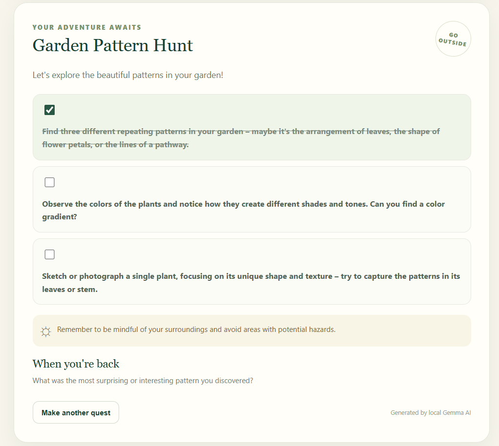
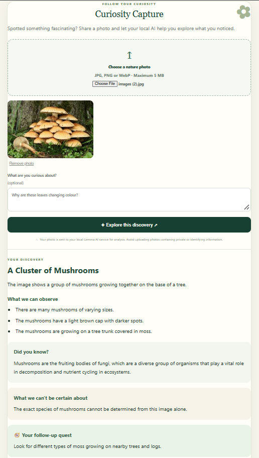
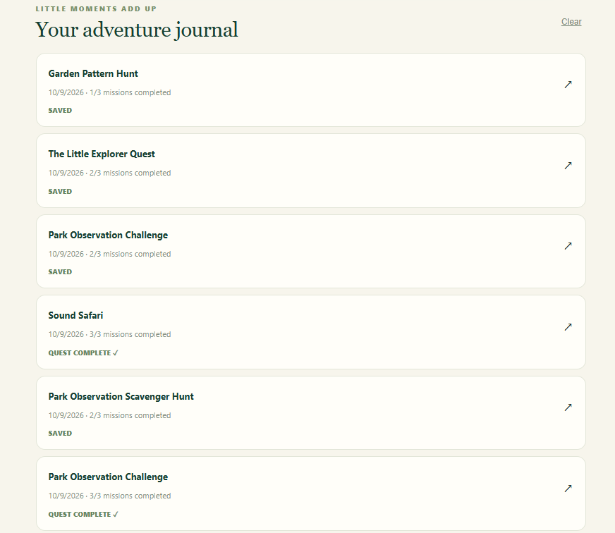

# NatureQuest 🌿

### Turn your free time into an outdoor adventure.

NatureQuest is a local AI-powered nature exploration app that encourages people to spend less time on screens and more time discovering the world around them.

Generate personalized outdoor quests based on your available time, surroundings, interests, and energy level. Spotted something interesting along the way? Use **Curiosity Capture** to explore a photo with your local AI and turn a simple observation into a new learning adventure.

## ✨ Features

### 🧭 Personalized Outdoor Quests

* Generate outdoor missions based on your time, setting, interests, and energy level.
* Break an adventure into manageable missions.
* Mark missions as complete as you explore.
* Save and revisit your quest history in your browser.

### 📸 Curiosity Capture

Turn a photo into an opportunity to learn something new.

Upload an image of a plant, fungus, insect, rock, or another interesting subject, and NatureQuest uses the local Gemma model through Ollama to generate:

* **Your Discovery:** A title and description of the subject.
* **What We Can Observe:** Visible details supported by the image.
* **Did You Know?:** An educational fact related to the discovery.
* **What We Can't Be Certain About:** Limitations and uncertainty in identification.
* **Your Follow-up Quest:** A suggested outdoor activity inspired by the discovery.

The goal is not just to identify something, but to encourage curiosity and further exploration.

## 📸 Screenshots

### Outdoor Quest Generator


### Curiosity Capture


### Adventure Journal


### 🤖 Local AI with a Fallback

* Uses the open-weight `gemma3:4b` model through Ollama for AI-generated content.
* Provides a rule-based fallback for outdoor quest generation when the AI is unavailable.
* Runs AI inference through a local Ollama service rather than requiring a hosted AI API for these features.

**Note:** Curiosity Capture requires Ollama and the Gemma model to be available. The fallback for quest generation does not mean every AI feature works without the model.

## 🛠️ Tech Stack

* **Python** — application backend
* **FastAPI** — API and server
* **HTML, CSS, JavaScript** — frontend
* **Ollama + Gemma 3 (4B)** — local AI text and image understanding
* **Browser storage** — quest history

## 📋 Requirements

* Windows 10 or Windows 11
* Python 3.10 or newer
* Git (optional, for cloning the repository)
* Ollama with the `gemma3:4b` model for AI features

## 🚀 Getting Started

### 1. Install Ollama

Download and install Ollama from [ollama.com/download/windows](https://ollama.com/download/windows).

Open PowerShell and download/run the model:

```powershell
ollama run gemma3:4b
```

On the first run, Ollama downloads the model, which requires several gigabytes of disk space. After confirming that it responds, type `/bye` to leave the chat.

Make sure the Ollama service is running when you use the AI features.

### 2. Get the Project

Clone the repository:

```powershell
git clone https://github.com/kunalGupta5780/NatureQuest.git
cd NatureQuest
```

Alternatively, download the project as a ZIP from GitHub and extract it.

### 3. Set Up Python

From the NatureQuest project folder, run:

```powershell
py -m venv .venv
```

Activate the environment:

```powershell
.\.venv\Scripts\Activate.ps1
```

Install the dependencies:

```powershell
python -m pip install -r requirements.txt
```

If PowerShell blocks environment activation, use the environment's Python executable directly:

```powershell
.\.venv\Scripts\python.exe -m pip install -r requirements.txt
```

### 4. Start NatureQuest

With the virtual environment activated, run:

```powershell
uvicorn main:app --reload
```

Or, without activating the environment:

```powershell
.\.venv\Scripts\python.exe -m uvicorn main:app --reload
```

Open http://127.0.0.1:8000 in your browser.

## 🧪 What to Test

* Generate quests with different time limits, settings, interests, and energy levels.
* Complete missions and refresh the page to check whether your quest history persists.
* Upload photos of different subjects using Curiosity Capture.
* Check whether the AI distinguishes visible observations from general educational facts.
* Test uncertain or ambiguous images and verify that the AI communicates its limitations.
* Stop the Ollama service and check the quest generator's fallback behavior.


## 📁 Project Structure

```text
NatureQuest/
├── main.py
├── requirements.txt
├── README.md
├── .gitignore
├── screenshots/
│   ├── quest-generator.png
│   ├── curiosity-capture.png
│   └── adventure-journal.png
└── static/
    ├── index.html
    ├── style.css
    └── app.js
```

## 🔒 Privacy and Responsible Use

NatureQuest sends AI requests to the local Ollama service configured for the application. Its AI features depend on your local model and service being available.

AI-generated descriptions and identifications may be incorrect. Treat them as suggestions rather than definitive scientific identification. Do not eat, collect, or handle unfamiliar plants, fungi, or animals based only on an AI response.

## 🌱 Project Goal

NatureQuest aims to make outdoor exploration more engaging by connecting real-world observations with accessible learning and small, achievable adventures.

**Notice something. Get curious. Go explore.**

---

**Repository:** [kunalGupta5780/NatureQuest](https://github.com/kunalGupta5780/NatureQuest)
